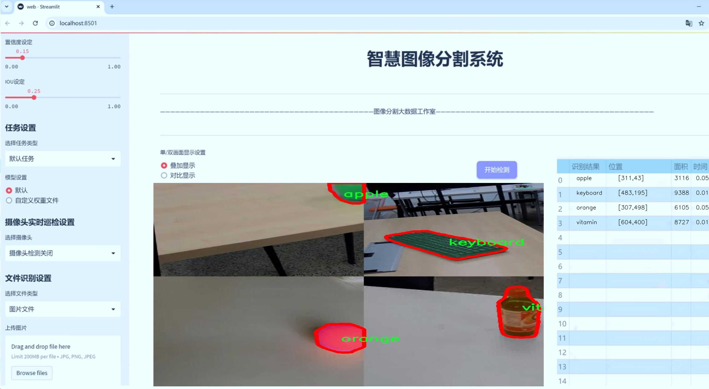

# 水果与饮料分割系统源码＆数据集分享
 [yolov8-seg-C2f-Faster-EMA＆yolov8-seg-vanillanet等50+全套改进创新点发刊_一键训练教程_Web前端展示]

### 1.研究背景与意义

项目参考[ILSVRC ImageNet Large Scale Visual Recognition Challenge](https://gitee.com/YOLOv8_YOLOv11_Segmentation_Studio/projects)

项目来源[AAAI Global Al lnnovation Contest](https://kdocs.cn/l/cszuIiCKVNis)

研究背景与意义

随着计算机视觉技术的快速发展，深度学习在图像分割领域的应用逐渐成为研究的热点。尤其是在物体检测与分割方面，YOLO（You Only Look Once）系列模型因其高效性和准确性而备受关注。YOLOv8作为该系列的最新版本，进一步提升了模型的性能，能够在实时处理和高精度分割之间取得良好的平衡。水果与饮料的分割不仅在食品安全、质量检测等领域具有重要意义，还在智能零售、自动化仓储等应用场景中发挥着越来越重要的作用。因此，基于改进YOLOv8的水果与饮料分割系统的研究具有重要的学术价值和实际应用意义。

本研究所使用的数据集包含3300张图像，涵盖了11个类别，其中包括苹果、香蕉、可乐、牛奶、橙子等多种水果和饮料。这些类别的选择不仅反映了日常生活中常见的消费品，还为模型的训练提供了丰富的样本。通过对这些图像进行实例分割，能够有效识别和区分不同类别的物体，为后续的图像分析和处理提供基础数据支持。此外，数据集中包含的多样化物体形态和背景环境，能够增强模型的泛化能力，使其在复杂场景下仍能保持良好的性能。

在实际应用中，水果与饮料的自动识别与分割可以大幅提高生产效率和准确性。例如，在自动化的水果分拣系统中，准确的物体分割能够帮助机器人快速识别和分类不同种类的水果，从而提高分拣速度和准确率。在智能零售领域，基于图像分割的商品识别技术可以实现无人货架的管理和监控，提升消费者的购物体验。此外，食品安全检测也可以借助该技术实现对水果和饮料的快速检测，确保产品质量。

然而，现有的图像分割技术在处理复杂背景、遮挡物体和光照变化等方面仍面临挑战。因此，改进YOLOv8模型以适应水果与饮料分割的特定需求，具有重要的研究意义。通过引入更先进的特征提取方法和优化的损失函数，能够提高模型在实例分割任务中的表现，进而提升整体的识别精度和速度。

综上所述，基于改进YOLOv8的水果与饮料分割系统的研究，不仅为深度学习在图像分割领域的应用提供了新的思路，也为相关行业的智能化发展奠定了基础。随着技术的不断进步，未来该系统有望在更广泛的场景中应用，推动智能视觉技术的进一步发展。

### 2.图片演示




##### 注意：由于此博客编辑较早，上面“2.图片演示”和“3.视频演示”展示的系统图片或者视频可能为老版本，新版本在老版本的基础上升级如下：（实际效果以升级的新版本为准）

  （1）适配了YOLOV8的“目标检测”模型和“实例分割”模型，通过加载相应的权重（.pt）文件即可自适应加载模型。

  （2）支持“图片识别”、“视频识别”、“摄像头实时识别”三种识别模式。

  （3）支持“图片识别”、“视频识别”、“摄像头实时识别”三种识别结果保存导出，解决手动导出（容易卡顿出现爆内存）存在的问题，识别完自动保存结果并导出到tempDir中。

  （4）支持Web前端系统中的标题、背景图等自定义修改，后面提供修改教程。

  另外本项目提供训练的数据集和训练教程,暂不提供权重文件（best.pt）,需要您按照教程进行训练后实现图片演示和Web前端界面演示的效果。

### 3.视频演示

[3.1 视频演示](https://www.bilibili.com/video/BV14g2PY1E9D/)

### 4.数据集信息展示

##### 4.1 本项目数据集详细数据（类别数＆类别名）

nc: 10
names: ['apple', 'banana', 'coke', 'keyboard', 'laptop', 'milk', 'mouse', 'orange', 'vitamin', 'waterbottle']


##### 4.2 本项目数据集信息介绍

数据集信息展示

在现代计算机视觉领域，数据集的质量和多样性对模型的训练效果至关重要。本研究所采用的数据集名为“all2ndvid”，专门用于训练和改进YOLOv8-seg的水果与饮料分割系统。该数据集包含10个不同的类别，涵盖了水果、饮料及相关物品，具体类别包括：苹果（apple）、香蕉（banana）、可乐（coke）、键盘（keyboard）、笔记本电脑（laptop）、牛奶（milk）、鼠标（mouse）、橙子（orange）、维生素（vitamin）和水瓶（waterbottle）。这些类别的选择不仅体现了日常生活中常见物品的多样性，也为模型的训练提供了丰富的场景和背景。

“all2ndvid”数据集的构建旨在为YOLOv8-seg提供一个全面的训练基础，使其能够在复杂的环境中准确识别和分割目标物体。每个类别的样本均经过精心挑选，确保其在形状、颜色、纹理等方面具有代表性。这种多样性使得模型在面对不同的视觉特征时，能够具备更强的适应能力和鲁棒性。例如，苹果和橙子作为水果类的代表，具有明显的颜色和形状特征，而可乐和牛奶则属于饮料类，二者在包装和颜色上存在显著差异。通过训练，YOLOv8-seg能够有效地识别这些物体，并在复杂背景中进行准确分割。

数据集中的每个类别不仅仅是简单的图像集合，还包含了丰富的标注信息。这些标注信息为模型提供了必要的监督信号，使其能够学习到不同物体的特征和边界。通过对每个类别进行细致的标注，研究人员能够确保模型在训练过程中能够获得准确的反馈，从而不断优化其分割能力。此外，数据集还包含了多种拍摄角度和光照条件下的样本，这进一步增强了模型的泛化能力，使其能够在实际应用中表现出色。

在训练过程中，YOLOv8-seg将利用“all2ndvid”数据集进行多轮迭代学习。通过不断调整模型参数和优化算法，研究团队期望能够显著提高模型在水果与饮料分割任务中的表现。最终目标是实现一个高效、准确的分割系统，能够在实时应用中快速识别和分割出目标物体，为智能零售、自动化仓储等领域提供技术支持。

综上所述，“all2ndvid”数据集不仅为YOLOv8-seg的训练提供了丰富的样本和标注信息，还为模型的优化和应用奠定了坚实的基础。通过对这一数据集的深入研究和应用，研究团队期待能够推动水果与饮料分割技术的发展，为相关行业带来更多的创新和变革。


### 5.全套项目环境部署视频教程（零基础手把手教学）

[5.1 环境部署教程链接（零基础手把手教学）](https://www.bilibili.com/video/BV1jG4Ve4E9t/?vd_source=bc9aec86d164b67a7004b996143742dc)


[5.2 安装Python虚拟环境创建和依赖库安装视频教程链接（零基础手把手教学）](https://www.bilibili.com/video/BV1nA4VeYEze/?vd_source=bc9aec86d164b67a7004b996143742dc)

### 6.手把手YOLOV8-seg训练视频教程（零基础小白有手就能学会）

[6.1 手把手YOLOV8-seg训练视频教程（零基础小白有手就能学会）](https://www.bilibili.com/video/BV1cA4VeYETe/?vd_source=bc9aec86d164b67a7004b996143742dc)


按照上面的训练视频教程链接加载项目提供的数据集，运行train.py即可开始训练



     Epoch   gpu_mem       box       obj       cls    labels  img_size
     1/200     0G   0.01576   0.01955  0.007536        22      1280: 100%|██████████| 849/849 [14:42<00:00,  1.04s/it]
               Class     Images     Labels          P          R     mAP@.5 mAP@.5:.95: 100%|██████████| 213/213 [01:14<00:00,  2.87it/s]
                 all       3395      17314      0.994      0.957      0.0957      0.0843

     Epoch   gpu_mem       box       obj       cls    labels  img_size
     2/200     0G   0.01578   0.01923  0.007006        22      1280: 100%|██████████| 849/849 [14:44<00:00,  1.04s/it]
               Class     Images     Labels          P          R     mAP@.5 mAP@.5:.95: 100%|██████████| 213/213 [01:12<00:00,  2.95it/s]
                 all       3395      17314      0.996      0.956      0.0957      0.0845

     Epoch   gpu_mem       box       obj       cls    labels  img_size
     3/200     0G   0.01561    0.0191  0.006895        27      1280: 100%|██████████| 849/849 [10:56<00:00,  1.29it/s]
               Class     Images     Labels          P          R     mAP@.5 mAP@.5:.95: 100%|███████   | 187/213 [00:52<00:00,  4.04it/s]
                 all       3395      17314      0.996      0.957      0.0957      0.0845


### 7.50+种全套YOLOV8-seg创新点代码加载调参视频教程（一键加载写好的改进模型的配置文件）

[7.1 50+种全套YOLOV8-seg创新点代码加载调参视频教程（一键加载写好的改进模型的配置文件）](https://www.bilibili.com/video/BV1Hw4VePEXv/?vd_source=bc9aec86d164b67a7004b996143742dc)

### 8.YOLOV8-seg图像分割算法原理

原始YOLOv8-seg算法原理

YOLOv8-seg算法是YOLO系列中的最新进展，旨在通过改进的网络结构和创新的技术手段，提升目标检测和分割的性能。该算法不仅继承了YOLO系列的高效性和实时性，还引入了更为复杂的特征提取和处理机制，以满足现代计算机视觉任务的需求。YOLOv8-seg的设计理念是通过高效的特征提取和智能的目标检测策略，实现对复杂场景中目标的精准识别和分割。

YOLOv8-seg的网络结构主要由三个部分组成：Backbone、Neck和Head。Backbone负责特征提取，采用了CSPDarknet结构，这一结构通过将网络分为两个部分，利用多个残差块来增强特征提取的能力。与前代模型YOLOv5相比，YOLOv8-seg引入了C2f模块替代了C3模块，C2f模块通过将输入特征图分为两个分支，并对每个分支进行卷积处理，从而实现特征的降维和增强。这种分支结构的设计使得网络能够更好地捕捉到不同层次的特征信息，并通过后续的卷积层进行融合，形成更高维度的特征图，进而提升模型的表达能力。

在特征提取过程中，YOLOv8-seg还引入了快速空间金字塔池化（SPPF）结构，以有效提取不同尺度的特征。这一结构的优势在于能够减少模型的参数量和计算量，同时提高特征提取的效率，使得YOLOv8-seg在处理高分辨率图像时，依然能够保持较高的实时性和准确性。通过这种多尺度特征提取机制，YOLOv8-seg能够更好地适应各种目标的大小变化，增强了模型在复杂场景下的鲁棒性。

Neck部分采用了特征金字塔网络（FPN）和路径聚合网络（PAN）的结合结构，旨在实现多尺度特征的融合和传递。该结构通过多个卷积层和池化层的组合，有效地处理和压缩特征图，使得模型能够更好地捕捉到目标的上下文信息。通过这种特征融合策略，YOLOv8-seg能够在目标检测时，充分利用不同层次的特征信息，提高检测的准确性和稳定性。

在Head部分，YOLOv8-seg采用了解耦合头结构，将分类和检测任务分开处理，进一步提升了模型的灵活性和准确性。不同于传统的Anchor-Based检测方式，YOLOv8-seg引入了Anchor-Free的检测策略，直接预测目标的中心点和宽高比例。这一创新不仅减少了Anchor框的数量，还提高了检测速度和准确度，使得YOLOv8-seg在实时应用中表现更加优异。

此外，YOLOv8-seg在训练过程中采用了一系列数据增强技术，以提升模型的泛化能力。通过在训练的最后阶段关闭马赛克增强，并使用动态的样本分配策略，YOLOv8-seg能够更好地适应不同场景下的目标特征，提升模型的学习效率。损失函数方面，YOLOv8-seg使用了BCELoss作为分类损失，DFLLoss和CIoULoss作为回归损失，这种多重损失计算方式能够更好地引导模型学习，提高检测和分割的精度。

总的来说，YOLOv8-seg算法通过对Backbone、Neck和Head部分的深度优化，结合先进的特征提取和处理机制，展现出了卓越的性能。其高效的特征提取能力、灵活的检测策略以及强大的数据增强技术，使得YOLOv8-seg在目标检测和分割任务中，能够实现更高的准确性和更快的处理速度。这一系列创新使得YOLOv8-seg不仅适用于传统的目标检测任务，还能够在复杂的图像分割场景中，展现出强大的应用潜力。随着YOLOv8-seg的不断发展和完善，未来在计算机视觉领域的应用前景将更加广阔。


### 9.系统功能展示（检测对象为举例，实际内容以本项目数据集为准）

图9.1.系统支持检测结果表格显示

  图9.2.系统支持置信度和IOU阈值手动调节

  图9.3.系统支持自定义加载权重文件best.pt(需要你通过步骤5中训练获得)

  图9.4.系统支持摄像头实时识别

  图9.5.系统支持图片识别

  图9.6.系统支持视频识别

  图9.7.系统支持识别结果文件自动保存

  图9.8.系统支持Excel导出检测结果数据


### 10.50+种全套YOLOV8-seg创新点原理讲解（非科班也可以轻松写刊发刊，V11版本正在科研待更新）

#### 10.1 由于篇幅限制，每个创新点的具体原理讲解就不一一展开，具体见下列网址中的创新点对应子项目的技术原理博客网址【Blog】：


[10.1 50+种全套YOLOV8-seg创新点原理讲解链接](https://gitee.com/qunmasj/good)

#### 10.2 部分改进模块原理讲解(完整的改进原理见上图和技术博客链接)【此小节的图要是加载失败请移步原始博客查看，链接：https://blog.csdn.net/cheng2333333?type=blog】
### YOLOv8简介
YOLO（You Only Look Once）是一种流行的对象检测和图像分割模型，由华盛顿大学的Joseph Redmon和Ali Farhadi开发。YOLO于2015年推出，以其高速度和高精度迅速走红。

YOLOv2于2016年发布，通过合并批处理规范化、锚盒和维度集群来改进原始模型
2018年推出的YOLOv3使用更高效的骨干网络、多个锚点和空间金字塔池进一步增强了该模型的性能
YOLOv4于2020年发布，引入了Mosaic数据增强、新的无锚检测头和新的丢失功能等创新
YOLOv5进一步提高了模型的性能，并添加了超参数优化、集成实验跟踪和自动导出到流行导出格式等新功能
YOLOv6于2022年由美团开源，目前正在该公司的许多自动配送机器人中使用
YOLOv7在COCO关键点数据集上添加了额外的任务，如姿态估计
YOLOv8是Ultralytics公司推出的YOLO的最新版本。作为一款尖端、最先进的（SOTA）车型，YOLOv8在之前版本的成功基础上，引入了新的功能和改进，以增强性能、灵活性和效率。YOLOv8支持全方位的视觉AI任务，包括检测、分割、姿态估计、跟踪和分类。这种多功能性允许用户在不同的应用程序和域中利用YOLOv8的功能
#### YOLOv8的新特性与可用模型

Ultralytics 并没有直接将开源库命名为 YOLOv8，而是直接使用 ultralytics 这个词，原因是 ultralytics 将这个库定位为算法框架，而非某一个特定算法，一个主要特点是可扩展性。其希望这个库不仅仅能够用于 YOLO 系列模型，而是能够支持非 YOLO 模型以及分类分割姿态估计等各类任务。总而言之，ultralytics 开源库的两个主要优点是：

融合众多当前 SOTA 技术于一体
未来将支持其他 YOLO 系列以及 YOLO 之外的更多算法
Ultralytics为YOLO模型发布了一个全新的存储库。它被构建为 用于训练对象检测、实例分割和图像分类模型的统一框架。

提供了一个全新的 SOTA 模型，包括 P5 640 和 P6 1280 分辨率的目标检测网络和基于 YOLACT 的实例分割模型。和 YOLOv5 一样，基于缩放系数也提供了 N/S/M/L/X 尺度的不同大小模型，用于满足不同场景需求
骨干网络和 Neck 部分可能参考了 YOLOv7 ELAN 设计思想，将 YOLOv5 的 C3 结构换成了梯度流更丰富的 C2f 结构，并对不同尺度模型调整了不同的通道数，属于对模型结构精心微调，不再是无脑一套参数应用所有模型，大幅提升了模型性能。不过这个 C2f 模块中存在 Split 等操作对特定硬件部署没有之前那么友好了
Head 部分相比 YOLOv5 改动较大，换成了目前主流的解耦头结构，将分类和检测头分离，同时也从 Anchor-Based 换成了 Anchor-Free
Loss 计算方面采用了 TaskAlignedAssigner 正样本分配策略，并引入了 Distribution Focal Loss
训练的数据增强部分引入了 YOLOX 中的最后 10 epoch 关闭 Mosiac 增强的操作，可以有效地提升精度
YOLOv8 还高效灵活地支持多种导出格式，并且该模型可以在 CPU 和 GPU 上运行。YOLOv8 模型的每个类别中有五个模型用于检测、分割和分类。YOLOv8 Nano 是最快和最小的，而 YOLOv8 Extra Large (YOLOv8x) 是其中最准确但最慢的。


### FocalModulation模型的基本原理
参考该博客，Focal Modulation Networks（FocalNets）的基本原理是替换自注意力（Self-Attention）模块，使用焦点调制（focal modulation）机制来捕捉图像中的长距离依赖和上下文信息。下图是自注意力和焦点调制两种方法的对比。


自注意力要求对每个查询令牌（Query Token）与其他令牌进行复杂的查询-键（Query-Key）交互和查询-值（Query-Value）聚合，以计算注意力分数并捕捉上下文。而焦点调制则先将空间上下文以不同粒度聚合到调制器中，然后以查询依赖的方式将这些调制器注入到查询令牌中。焦点调制简化了交互和聚合操作，使其更轻量级。在图中，自注意力部分使用红色虚线表示查询-键交互和黄色虚线表示查询-值聚合，而焦点调制部分则用蓝色表示调制器聚合和黄色表示查询-调制器交互。 

FocalModulation模型通过以下步骤实现：

1. 焦点上下文化：用深度卷积层堆叠来编码不同范围的视觉上下文。


2. 门控聚合：通过门控机制，选择性地将上下文信息聚合到每个查询令牌的调制器中。


3. 逐元素仿射变换：将聚合后的调制器通过仿射变换注入到每个查询令牌中。

下面来分别介绍这三个机制->

#### 焦点上下文化
焦点上下文化（Focal Contextualization）是焦点调制（Focal Modulation）的一个组成部分。焦点上下文化使用一系列深度卷积层（depth-wise convolutional layers）来编码不同范围内的视觉上下文信息。这些层可以捕捉从近处到远处的视觉特征，从而允许网络在不同层次上理解图像内容。通过这种方式，网络能够在聚合上下文信息时保持对局部细节的敏感性，并增强对全局结构的认识。


​

这张图详细比较了自注意力（Self-Attention, SA）和焦点调制（Focal Modulation）的机制，并特别展示了焦点调制中的上下文聚合过程。左侧的图展示了自注意力模型如何通过键（k）和查询（q）之间的交互，以及随后的聚合来生成输出。而中间和右侧的图说明了焦点调制如何通过层级化的上下文聚合和门控聚合过程替代自注意力模型的这一过程。在焦点调制中，输入首先通过轻量级线性层进行处理，然后通过层级化的上下文化模块和门控机制来选择性地聚合信息，最终通过调制器与查询（q）进行交互以生成输出。

#### 门控聚合
在Focal Modulation Networks（FocalNets）中的 "门控聚合"（Gated Aggregation）是关键组件之一，这一过程涉及使用门控机制来选择性地聚合上下文信息。以下是这个过程的详细分析：

1. 什么是门控机制？
门控机制在深度学习中常用于控制信息流。它通常用于决定哪些信息应该被传递，哪些应该被阻断。在循环神经网络（RNN）中，特别是在长短期记忆网络（LSTM）和门控循环单元（GRU）中，门控机制用于调节信息在时间序列数据中的流动。

2. 门控聚合的目的
在FocalNets中，门控聚合的目的是为每个查询令牌（即处理中的数据单元）选择性地聚合上下文信息。这意味着网络能够决定哪些特定的上下文信息对于当前处理的查询令牌是重要的，从而专注于那些最相关的信息。

3. 如何实现门控聚合？
实现门控聚合可能涉及一系列计算步骤，其中包括：

计算上下文信息：这可能涉及使用深度卷积层（如文中提到的）对输入图像的不同区域进行编码，以捕捉从局部到全局的视觉上下文。
门控操作：这一步骤涉及到一个决策过程，根据当前查询令牌的特征来决定哪些上下文信息是相关的。这可能通过一个学习到的权重（门）来实现，该权重决定了不同上下文信息的重要性。
信息聚合：最后，根据门控操作的结果，选择性地聚合上下文信息到一个调制器中。这个调制器随后被用于调整或“调制”查询令牌的表示。
4. 门控聚合的好处
通过门控聚合，FocalNets能够更有效地聚焦于对当前任务最关键的信息。这种方法提高了模型的效率和性能，因为它减少了不必要信息的处理，同时增强了对关键特征的关注。在视觉任务中，这可能意味着更好的目标检测和图像分类性能，特别是在复杂或多变的视觉环境中。

总结：门控聚合是FocalNets的一个核心组成部分，它通过选择性地集中处理重要的上下文信息来提升网络的效率和性能。

#### 逐元素仿射变换
在Focal Modulation Networks（FocalNets）中的第三个关键组件是逐元素仿射变换，这个步骤涉及将通过门控聚合得到的调制器注入到每个查询令牌中。以下是该过程的详细分析：

1. 仿射变换的基本概念：
仿射变换是一种线性变换，用于对数据进行缩放、旋转、平移和倾斜等操作。在深度学习中，逐元素的仿射变换通常指的是对每个元素进行线性变换，这种变换可以被描述为y = ax + b，其中x是输入，y是输出，a和b是变换的参数。

2. 逐元素仿射变换的作用：
在FocalNets中，逐元素仿射变换的作用是将聚合后的调制器信息注入到每个查询令牌中。这个步骤对于整合上下文信息和查询令牌的原始特征非常重要。通过这种方式，调制器所包含的上下文信息可以直接影响查询令牌的表示。

3. 执行仿射变换：
执行这一步骤时，聚合后的调制器对每个查询令牌进行逐元素的仿射变换。在实践中，这可能意味着对查询令牌的每个特征应用调制器中的相应权重（a）和偏差（b）。这样，调制器中的每个元素都直接对应于查询令牌的一个特征，通过调整这些特征来改变其表达。

4. 仿射变换的效果：
通过逐元素仿射变换，模型能够更细致地调整每个查询令牌的特征，根据上下文信息来增强或抑制某些特征。这种精细的调整机制允许网络更好地适应复杂的视觉场景，提高对细节的捕捉能力，从而提升了模型在各种视觉任务中的性能，如目标检测和图像分类。

总结：逐元素仿射变换它使得模型能够利用上下文信息来有效地调整查询令牌，增强了模型对关键视觉特征的捕捉和表达能力。


### 11.项目核心源码讲解（再也不用担心看不懂代码逻辑）

#### 11.1 ui.py

以下是代码的核心部分，并附上详细的中文注释：

```python
import sys
import subprocess

def run_script(script_path):
    """
    使用当前 Python 环境运行指定的脚本。

    Args:
        script_path (str): 要运行的脚本路径

    Returns:
        None
    """
    # 获取当前 Python 解释器的路径
    python_path = sys.executable

    # 构建运行命令，使用 streamlit 运行指定的脚本
    command = f'"{python_path}" -m streamlit run "{script_path}"'

    # 执行命令
    result = subprocess.run(command, shell=True)
    # 检查命令执行结果，如果返回码不为0，则表示出错
    if result.returncode != 0:
        print("脚本运行出错。")

# 实例化并运行应用
if __name__ == "__main__":
    # 指定要运行的脚本路径
    script_path = "web.py"  # 这里可以直接指定脚本名称，假设在当前目录下

    # 调用函数运行脚本
    run_script(script_path)
```

### 代码分析：
1. **导入模块**：
   - `sys`：用于访问与 Python 解释器相关的变量和函数。
   - `subprocess`：用于执行外部命令。

2. **run_script 函数**：
   - 接收一个参数 `script_path`，表示要运行的 Python 脚本的路径。
   - 使用 `sys.executable` 获取当前 Python 解释器的路径，以确保使用正确的 Python 环境。
   - 构建命令字符串，使用 `streamlit` 模块运行指定的脚本。
   - 使用 `subprocess.run` 执行命令，并检查返回码以判断脚本是否成功运行。

3. **主程序入口**：
   - 使用 `if __name__ == "__main__":` 确保只有在直接运行该脚本时才会执行下面的代码。
   - 指定要运行的脚本路径为 `web.py`。
   - 调用 `run_script` 函数执行该脚本。 

这样，代码的核心功能是运行一个指定的 Python 脚本，并确保在执行过程中能够捕获可能的错误。

这个文件名为 `ui.py`，它的主要功能是通过当前的 Python 环境来运行一个指定的脚本，具体来说是运行一个名为 `web.py` 的脚本。文件中首先导入了一些必要的模块，包括 `sys`、`os` 和 `subprocess`，以及一个自定义的模块 `QtFusion.path` 中的 `abs_path` 函数。

在文件的主体部分，定义了一个名为 `run_script` 的函数，该函数接受一个参数 `script_path`，表示要运行的脚本的路径。函数内部首先获取当前 Python 解释器的路径，并将其存储在 `python_path` 变量中。接着，构建一个命令字符串 `command`，这个命令使用 `streamlit` 来运行指定的脚本。`streamlit` 是一个用于构建数据应用的库。

随后，使用 `subprocess.run` 方法来执行这个命令。这个方法会在一个新的子进程中运行命令，并等待其完成。如果脚本运行返回的状态码不为零，表示出现了错误，程序会打印出“脚本运行出错。”的提示信息。

在文件的最后部分，使用 `if __name__ == "__main__":` 语句来确保只有在直接运行这个文件时才会执行下面的代码。在这里，首先调用 `abs_path` 函数来获取 `web.py` 的绝对路径，并将其赋值给 `script_path` 变量。最后，调用 `run_script` 函数并传入 `script_path`，从而启动 `web.py` 脚本的运行。

总的来说，这个文件的作用是提供一个简单的接口，通过命令行来运行一个 Streamlit 应用脚本，并处理可能出现的错误。

#### 11.2 ultralytics\models\nas\__init__.py

以下是保留的核心代码部分，并附上详细的中文注释：

```python
# 导入所需的模块和类
from .model import NAS  # 从当前包的model模块导入NAS类
from .predict import NASPredictor  # 从当前包的predict模块导入NASPredictor类
from .val import NASValidator  # 从当前包的val模块导入NASValidator类

# 定义当前模块的公开接口
__all__ = 'NASPredictor', 'NASValidator', 'NAS'  # 指定当使用from module import *时，公开的类和函数
```

### 注释说明：
1. **导入模块**：
   - `from .model import NAS`：从当前包的`model`模块中导入`NAS`类，`NAS`可能是一个神经网络架构或模型的定义。
   - `from .predict import NASPredictor`：从当前包的`predict`模块中导入`NASPredictor`类，`NASPredictor`可能用于对输入数据进行预测。
   - `from .val import NASValidator`：从当前包的`val`模块中导入`NASValidator`类，`NASValidator`可能用于验证模型的性能。

2. **定义公开接口**：
   - `__all__`是一个特殊变量，用于定义当前模块的公共接口。当使用`from module import *`时，只有在`__all__`中列出的名称会被导入。这有助于控制模块的可见性，避免不必要的名称冲突。

这个程序文件是Ultralytics YOLO项目中的一个初始化文件，位于`ultralytics\models\nas\__init__.py`。该文件的主要功能是导入和定义模块的公共接口。

首先，文件开头有一行注释，表明这是Ultralytics YOLO项目的一部分，并且该项目遵循AGPL-3.0许可证。这种许可证通常用于开源软件，允许用户自由使用、修改和分发软件，但要求在分发时保持相同的许可证。

接下来，文件通过相对导入的方式引入了三个组件：`NAS`、`NASPredictor`和`NASValidator`。这些组件分别来自于同一目录下的`model`、`predict`和`val`模块。`NAS`可能是一个模型类，负责定义和训练神经架构搜索（Neural Architecture Search）相关的模型；`NASPredictor`可能是一个用于进行预测的类，负责处理输入数据并生成模型的输出；而`NASValidator`则可能用于验证模型的性能，评估其在特定数据集上的表现。

最后，`__all__`变量被定义为一个元组，包含了三个字符串：`'NASPredictor'`、`'NASValidator'`和`'NAS'`。这个变量的作用是指明当使用`from module import *`语句时，哪些名称是公共的，哪些名称应该被导入。通过这种方式，模块的使用者可以清楚地知道可以使用哪些类或函数，而不必担心内部实现的细节。

总体而言，这个初始化文件的作用是组织和暴露与神经架构搜索相关的功能，使得其他模块或用户能够方便地使用这些功能。

#### 11.3 ultralytics\nn\backbone\convnextv2.py

以下是经过简化和注释的核心代码部分，保留了ConvNeXtV2模型的主要结构和功能：

```python
import torch
import torch.nn as nn
import torch.nn.functional as F

class LayerNorm(nn.Module):
    """ 自定义的LayerNorm层，支持两种数据格式：channels_last和channels_first。 """
    def __init__(self, normalized_shape, eps=1e-6, data_format="channels_last"):
        super().__init__()
        # 权重和偏置参数
        self.weight = nn.Parameter(torch.ones(normalized_shape))
        self.bias = nn.Parameter(torch.zeros(normalized_shape))
        self.eps = eps
        self.data_format = data_format
        if self.data_format not in ["channels_last", "channels_first"]:
            raise NotImplementedError 
        self.normalized_shape = (normalized_shape, )
    
    def forward(self, x):
        # 根据数据格式进行归一化
        if self.data_format == "channels_last":
            return F.layer_norm(x, self.normalized_shape, self.weight, self.bias, self.eps)
        elif self.data_format == "channels_first":
            u = x.mean(1, keepdim=True)
            s = (x - u).pow(2).mean(1, keepdim=True)
            x = (x - u) / torch.sqrt(s + self.eps)
            x = self.weight[:, None, None] * x + self.bias[:, None, None]
            return x

class Block(nn.Module):
    """ ConvNeXtV2的基本模块，包含深度卷积、归一化、激活和全连接层。 """
    def __init__(self, dim):
        super().__init__()
        self.dwconv = nn.Conv2d(dim, dim, kernel_size=7, padding=3, groups=dim)  # 深度卷积
        self.norm = LayerNorm(dim, eps=1e-6)
        self.pwconv1 = nn.Linear(dim, 4 * dim)  # 1x1卷积
        self.act = nn.GELU()  # 激活函数
        self.pwconv2 = nn.Linear(4 * dim, dim)  # 1x1卷积

    def forward(self, x):
        input = x
        x = self.dwconv(x)  # 深度卷积
        x = x.permute(0, 2, 3, 1)  # 变换维度顺序
        x = self.norm(x)  # 归一化
        x = self.pwconv1(x)  # 第一个1x1卷积
        x = self.act(x)  # 激活
        x = self.pwconv2(x)  # 第二个1x1卷积
        x = x.permute(0, 3, 1, 2)  # 恢复维度顺序
        return input + x  # 残差连接

class ConvNeXtV2(nn.Module):
    """ ConvNeXt V2模型，包含多个阶段和下采样层。 """
    def __init__(self, in_chans=3, num_classes=1000, depths=[3, 3, 9, 3], dims=[96, 192, 384, 768]):
        super().__init__()
        self.downsample_layers = nn.ModuleList()  # 下采样层
        # 初始卷积层
        stem = nn.Sequential(
            nn.Conv2d(in_chans, dims[0], kernel_size=4, stride=4),
            LayerNorm(dims[0], eps=1e-6, data_format="channels_first")
        )
        self.downsample_layers.append(stem)
        # 添加下采样层
        for i in range(3):
            downsample_layer = nn.Sequential(
                LayerNorm(dims[i], eps=1e-6, data_format="channels_first"),
                nn.Conv2d(dims[i], dims[i+1], kernel_size=2, stride=2),
            )
            self.downsample_layers.append(downsample_layer)

        self.stages = nn.ModuleList()  # 特征提取阶段
        for i in range(4):
            stage = nn.Sequential(
                *[Block(dim=dims[i]) for _ in range(depths[i])]
            )
            self.stages.append(stage)

        self.norm = nn.LayerNorm(dims[-1], eps=1e-6)  # 最后的归一化层
        self.head = nn.Linear(dims[-1], num_classes)  # 分类头

    def forward(self, x):
        for i in range(4):
            x = self.downsample_layers[i](x)  # 下采样
            x = self.stages[i](x)  # 特征提取
        return x  # 返回最后的特征图

# 示例：创建ConvNeXtV2模型
def convnextv2_tiny(weights='', **kwargs):
    model = ConvNeXtV2(depths=[3, 3, 9, 3], dims=[96, 192, 384, 768], **kwargs)
    return model
```

### 代码注释说明：
1. **LayerNorm类**：实现了自定义的LayerNorm层，支持两种数据格式，提供了归一化功能。
2. **Block类**：定义了ConvNeXtV2的基本模块，包含深度卷积、归一化、激活和全连接层，使用残差连接。
3. **ConvNeXtV2类**：构建了整个ConvNeXtV2模型，包含下采样层和多个特征提取阶段。
4. **convnextv2_tiny函数**：提供了一个简单的接口来创建ConvNeXtV2模型的实例。

这个程序文件定义了一个名为 `ConvNeXtV2` 的深度学习模型，主要用于图像分类任务。文件中包含了多个类和函数，下面对其进行逐一说明。

首先，文件导入了必要的库，包括 PyTorch 及其相关模块，以及 NumPy 和 `timm` 库中的一些功能。接着，定义了一个 `LayerNorm` 类，它实现了层归一化功能，支持两种数据格式：`channels_last` 和 `channels_first`。这个类的构造函数接受归一化的形状、一个小的 epsilon 值以及数据格式，并在前向传播中根据输入的格式应用相应的归一化操作。

接下来，定义了一个 `GRN` 类，它实现了全局响应归一化层。该层通过计算输入的 L2 范数并进行归一化，来调整输入特征的响应。它使用两个可学习的参数 `gamma` 和 `beta` 来控制输出。

然后是 `Block` 类，代表 ConvNeXtV2 的基本构建块。这个类包含一个深度可分离卷积层、层归一化、两个点卷积层（通过线性层实现）、激活函数（GELU）和 GRN 层。前向传播过程中，输入经过深度卷积、归一化、点卷积、激活、GRN 处理后，再通过第二个点卷积层输出，最后与输入进行残差连接，并应用随机深度（DropPath）策略。

`ConvNeXtV2` 类是整个模型的核心。它的构造函数接受输入通道数、分类头的类别数、每个阶段的块数、每个阶段的特征维度、随机深度率和分类器权重的初始化缩放值。模型的前期部分包括一个初始卷积层和三个下采样层，后面是四个特征分辨率阶段，每个阶段由多个残差块组成。模型的最后部分是一个层归一化层和一个线性分类头。模型的权重在初始化时使用截断正态分布进行初始化。

此外，文件中还定义了一个 `update_weight` 函数，用于更新模型的权重字典，确保新权重与模型结构匹配。接下来，定义了一系列函数（如 `convnextv2_atto`、`convnextv2_femto` 等），这些函数用于创建不同规模的 ConvNeXtV2 模型，并可选择加载预训练权重。

总体来说，这个文件实现了 ConvNeXtV2 模型的结构，提供了灵活的配置选项和预训练权重加载功能，适用于图像分类等任务。

#### 11.4 ultralytics\utils\callbacks\base.py

以下是经过简化和注释的核心代码部分：

```python
# Ultralytics YOLO 🚀, AGPL-3.0 license
"""基础回调函数定义。"""

from collections import defaultdict
from copy import deepcopy

# 默认回调函数字典，包含训练、验证、预测和导出过程中的回调函数
default_callbacks = {
    # 训练过程中的回调
    'on_train_start': [lambda trainer: print("训练开始")],
    'on_train_epoch_end': [lambda trainer: print("训练轮次结束")],
    'on_train_end': [lambda trainer: print("训练结束")],

    # 验证过程中的回调
    'on_val_start': [lambda validator: print("验证开始")],
    'on_val_end': [lambda validator: print("验证结束")],

    # 预测过程中的回调
    'on_predict_start': [lambda predictor: print("预测开始")],
    'on_predict_end': [lambda predictor: print("预测结束")],

    # 导出过程中的回调
    'on_export_start': [lambda exporter: print("导出开始")],
    'on_export_end': [lambda exporter: print("导出结束")]
}

def get_default_callbacks():
    """
    返回一个默认回调字典的副本，字典的值为默认空列表。

    返回:
        (defaultdict): 一个defaultdict，包含default_callbacks的键和空列表作为默认值。
    """
    return defaultdict(list, deepcopy(default_callbacks))

def add_integration_callbacks(instance):
    """
    将来自不同来源的集成回调添加到实例的回调中。

    参数:
        instance (Trainer, Predictor, Validator, Exporter): 一个具有'callbacks'属性的对象，该属性是一个回调列表的字典。
    """
    # 加载HUB回调
    from .hub import callbacks as hub_cb
    callbacks_list = [hub_cb]

    # 如果实例是Trainer类，则加载训练相关的回调
    if 'Trainer' in instance.__class__.__name__:
        from .clearml import callbacks as clear_cb
        from .comet import callbacks as comet_cb
        # 其他回调的加载省略...
        callbacks_list.extend([clear_cb, comet_cb])

    # 将回调添加到回调字典中
    for callbacks in callbacks_list:
        for k, v in callbacks.items():
            if v not in instance.callbacks[k]:
                instance.callbacks[k].append(v)
```

### 代码说明：
1. **default_callbacks**: 定义了一个字典，包含了在训练、验证、预测和导出过程中可能会调用的回调函数。每个回调函数在特定事件发生时被调用，比如训练开始、训练结束等。

2. **get_default_callbacks**: 这个函数返回一个默认回调字典的副本，确保每次调用都得到一个新的字典，避免对原始字典的修改。

3. **add_integration_callbacks**: 这个函数将不同来源的回调函数添加到给定实例的回调字典中。根据实例的类型（如Trainer），加载相应的回调模块并将其添加到回调列表中。

这个程序文件 `ultralytics/utils/callbacks/base.py` 定义了一系列的回调函数，这些函数在不同的训练、验证、预测和导出阶段被调用。回调函数是一种在特定事件发生时执行的函数，通常用于监控和控制训练过程。

文件开头包含了一些必要的导入，包括 `defaultdict` 和 `deepcopy`，这些是为了处理回调函数的存储和复制。接下来，文件中定义了多个回调函数，分为四个主要部分：训练回调、验证回调、预测回调和导出回调。

在训练回调部分，定义了一系列函数，例如 `on_train_start`、`on_train_epoch_start`、`on_train_batch_start` 等。这些函数在训练的不同阶段被调用，允许开发者在训练开始、每个epoch开始、每个batch开始等时刻插入自定义逻辑。比如，`optimizer_step` 函数在优化器更新参数时被调用，而 `on_train_end` 则在训练结束时调用。

验证回调部分包含了类似的函数，如 `on_val_start`、`on_val_batch_start` 和 `on_val_end`，这些函数在验证过程的不同阶段被调用，帮助监控模型在验证集上的表现。

预测回调部分则包括了 `on_predict_start`、`on_predict_batch_start` 和 `on_predict_end` 等函数，这些函数在进行模型预测时被调用，允许用户在预测过程的不同阶段执行特定操作。

导出回调部分相对简单，包含了 `on_export_start` 和 `on_export_end`，用于在模型导出时执行操作。

文件中还定义了一个 `default_callbacks` 字典，包含了所有回调函数的映射关系，便于在不同的上下文中调用相应的回调。

`get_default_callbacks` 函数返回一个默认回调字典的副本，使用 `defaultdict` 来确保每个键都有一个空列表作为默认值。

最后，`add_integration_callbacks` 函数用于将来自不同来源的集成回调添加到实例的回调字典中。这个函数会根据传入的实例类型（如训练器、预测器、验证器或导出器）加载相应的回调，并将它们添加到实例的回调列表中。这使得系统能够灵活地集成各种外部回调，增强了模型训练和评估的功能。

总的来说，这个文件为模型训练、验证、预测和导出提供了一个灵活的回调机制，允许用户在关键时刻插入自定义逻辑，以便更好地监控和控制模型的训练过程。

#### 11.5 train.py

以下是代码中最核心的部分，并附上详细的中文注释：

```python
import os
import torch
import yaml
from ultralytics import YOLO  # 导入YOLO模型

if __name__ == '__main__':  # 确保该模块被直接运行时才执行以下代码
    # 设置训练参数
    workers = 1  # 数据加载的工作进程数量
    batch = 8  # 每个批次的样本数量
    device = "0" if torch.cuda.is_available() else "cpu"  # 判断是否使用GPU

    # 获取数据集的yaml配置文件的绝对路径
    data_path = abs_path(f'datasets/data/data.yaml', path_type='current')  

    # 读取YAML文件，保持原有顺序
    with open(data_path, 'r') as file:
        data = yaml.load(file, Loader=yaml.FullLoader)
    
    # 修改数据集中训练、验证和测试的路径
    if 'train' in data and 'val' in data and 'test' in data:
        directory_path = os.path.dirname(data_path.replace(os.sep, '/'))  # 获取目录路径
        data['train'] = directory_path + '/train'  # 更新训练集路径
        data['val'] = directory_path + '/val'  # 更新验证集路径
        data['test'] = directory_path + '/test'  # 更新测试集路径

        # 将修改后的数据写回YAML文件
        with open(data_path, 'w') as file:
            yaml.safe_dump(data, file, sort_keys=False)

    # 加载YOLO模型，使用指定的配置文件和预训练权重
    model = YOLO(r"C:\codeseg\codenew\50+种YOLOv8算法改进源码大全和调试加载训练教程（非必要）\改进YOLOv8模型配置文件\yolov8-seg-C2f-Faster.yaml").load("./weights/yolov8s-seg.pt")

    # 开始训练模型
    results = model.train(  
        data=data_path,  # 指定训练数据的配置文件路径
        device=device,  # 使用指定的设备进行训练
        workers=workers,  # 指定使用的工作进程数量
        imgsz=640,  # 输入图像的大小为640x640
        epochs=100,  # 训练100个epoch
        batch=batch,  # 每个批次的大小为8
    )
```

### 代码注释说明：
1. **导入必要的库**：引入了`os`、`torch`、`yaml`和`YOLO`模型等库，后者用于目标检测任务。
2. **主程序入口**：通过`if __name__ == '__main__':`确保代码仅在直接运行时执行。
3. **设置训练参数**：定义了数据加载的工作进程数量、批次大小和设备类型（GPU或CPU）。
4. **获取数据集路径**：使用`abs_path`函数获取数据集配置文件的绝对路径。
5. **读取和修改YAML文件**：读取YAML文件，更新训练、验证和测试数据的路径，并将修改后的内容写回文件。
6. **加载YOLO模型**：指定模型的配置文件和预训练权重，加载YOLO模型。
7. **开始训练模型**：调用`model.train`方法，传入训练参数，开始模型训练。

这个程序文件`train.py`的主要功能是使用YOLO（You Only Look Once）模型进行图像分割任务的训练。程序首先导入了必要的库，包括`os`、`torch`、`yaml`和`ultralytics`中的YOLO模型。此外，还导入了`matplotlib`库用于绘图，设置为使用TkAgg后端。

在`__main__`模块中，程序首先定义了一些训练参数，包括工作进程数`workers`、批次大小`batch`、以及设备`device`。设备的选择基于当前系统是否支持CUDA（即是否有可用的GPU），如果有则使用GPU，否则使用CPU。

接下来，程序通过`abs_path`函数获取数据集配置文件`data.yaml`的绝对路径，并将其转换为Unix风格的路径。然后，程序提取该路径的目录部分，以便后续构建训练、验证和测试数据集的路径。

程序使用`yaml`库读取`data.yaml`文件，并在确认文件中包含`train`、`val`和`test`字段后，修改这些字段的值为相应的目录路径。修改完成后，程序将更新后的数据写回到`data.yaml`文件中。

接下来，程序加载YOLO模型的配置文件，并使用预训练的权重文件进行初始化。模型的路径是硬编码的，指向一个特定的配置文件和权重文件。

最后，程序调用模型的`train`方法开始训练，传入了训练数据的配置文件路径、设备、工作进程数、输入图像大小、训练的epoch数量以及批次大小等参数。训练过程将在指定的参数下进行，模型将根据提供的数据进行学习和优化。

#### 11.6 ultralytics\solutions\ai_gym.py

以下是代码中最核心的部分，并附上详细的中文注释：

```python
import cv2
from ultralytics.utils.plotting import Annotator

class AIGym:
    """管理基于姿势的实时视频流中的健身步骤的类。"""

    def __init__(self):
        """初始化AIGym，设置视觉和图像参数的默认值。"""
        self.im0 = None  # 当前帧图像
        self.tf = None   # 线条厚度
        self.keypoints = None  # 姿势关键点
        self.poseup_angle = None  # 上升姿势的角度阈值
        self.posedown_angle = None  # 下降姿势的角度阈值
        self.threshold = 0.001  # 阈值，用于姿势判断
        self.angle = None  # 当前角度
        self.count = None  # 当前计数
        self.stage = None  # 当前阶段（上/下）
        self.pose_type = 'pushup'  # 姿势类型（俯卧撑、引体向上或腹部锻炼）
        self.kpts_to_check = None  # 用于计数的关键点
        self.view_img = False  # 是否显示图像
        self.annotator = None  # 注释工具

    def set_args(self, kpts_to_check, line_thickness=2, view_img=False, pose_up_angle=145.0, pose_down_angle=90.0, pose_type='pullup'):
        """
        配置AIGym的参数
        Args:
            kpts_to_check (list): 用于计数的3个关键点
            line_thickness (int): 边界框的线条厚度
            view_img (bool): 是否显示图像
            pose_up_angle (float): 设置上升姿势的角度
            pose_down_angle (float): 设置下降姿势的角度
            pose_type: "pushup", "pullup" 或 "abworkout"
        """
        self.kpts_to_check = kpts_to_check  # 设置要检查的关键点
        self.tf = line_thickness  # 设置线条厚度
        self.view_img = view_img  # 设置是否显示图像
        self.poseup_angle = pose_up_angle  # 设置上升姿势的角度
        self.posedown_angle = pose_down_angle  # 设置下降姿势的角度
        self.pose_type = pose_type  # 设置姿势类型

    def start_counting(self, im0, results, frame_count):
        """
        计数健身步骤的函数
        Args:
            im0 (ndarray): 当前视频流帧
            results: 姿势估计数据
            frame_count: 当前帧计数
        """
        self.im0 = im0  # 保存当前帧图像
        if frame_count == 1:
            self.count = [0] * len(results[0])  # 初始化计数
            self.angle = [0] * len(results[0])  # 初始化角度
            self.stage = ['-' for _ in results[0]]  # 初始化阶段

        self.keypoints = results[0].keypoints.data  # 获取关键点数据
        self.annotator = Annotator(im0, line_width=2)  # 初始化注释工具

        for ind, k in enumerate(reversed(self.keypoints)):
            # 计算姿势角度
            self.angle[ind] = self.annotator.estimate_pose_angle(
                k[int(self.kpts_to_check[0])].cpu(),
                k[int(self.kpts_to_check[1])].cpu(),
                k[int(self.kpts_to_check[2])].cpu()
            )
            self.im0 = self.annotator.draw_specific_points(k, self.kpts_to_check, shape=(640, 640), radius=10)  # 绘制关键点

            # 根据姿势类型更新阶段和计数
            if self.pose_type == 'pushup':
                if self.angle[ind] > self.poseup_angle:
                    self.stage[ind] = 'up'
                if self.angle[ind] < self.posedown_angle and self.stage[ind] == 'up':
                    self.stage[ind] = 'down'
                    self.count[ind] += 1

            elif self.pose_type == 'pullup':
                if self.angle[ind] > self.poseup_angle:
                    self.stage[ind] = 'down'
                if self.angle[ind] < self.posedown_angle and self.stage[ind] == 'down':
                    self.stage[ind] = 'up'
                    self.count[ind] += 1

            # 绘制角度、计数和阶段信息
            self.annotator.plot_angle_and_count_and_stage(
                angle_text=self.angle[ind],
                count_text=self.count[ind],
                stage_text=self.stage[ind],
                center_kpt=k[int(self.kpts_to_check[1])],
                line_thickness=self.tf
            )

            self.annotator.kpts(k, shape=(640, 640), radius=1, kpt_line=True)  # 绘制所有关键点

        # 显示图像
        if self.view_img:
            cv2.imshow('Ultralytics YOLOv8 AI GYM', self.im0)
            if cv2.waitKey(1) & 0xFF == ord('q'):
                return

if __name__ == '__main__':
    AIGym()  # 创建AIGym实例
```

### 代码核心部分解释：
1. **类初始化**：在`__init__`方法中，定义了多个属性，用于存储图像、关键点、计数、角度和阶段等信息。
2. **参数设置**：`set_args`方法用于配置关键点、线条厚度、是否显示图像以及姿势的角度阈值和类型。
3. **计数逻辑**：`start_counting`方法是核心功能，负责根据视频流中的姿势估计数据来计算健身动作的数量。根据不同的姿势类型（俯卧撑、引体向上等），更新角度、阶段和计数，并使用`Annotator`类绘制关键点和相关信息。
4. **图像显示**：如果设置了显示图像的参数，则使用OpenCV显示当前帧，并在按下'q'键时退出。

这个程序文件定义了一个名为 `AIGym` 的类，主要用于在实时视频流中基于人体姿态管理健身动作的计数。程序的核心功能是通过分析视频帧中的关键点，来判断用户的健身动作（如俯卧撑、引体向上等），并进行计数。

在 `AIGym` 类的初始化方法中，定义了一些基本的属性，包括图像、线条厚度、关键点、角度、计数和阶段等信息。具体来说，`im0` 用于存储当前帧图像，`tf` 是线条的厚度，`keypoints` 存储关键点数据，`poseup_angle` 和 `posedown_angle` 分别表示动作的上升和下降角度，`count` 用于记录动作的次数，`stage` 表示当前的动作阶段，`pose_type` 用于指定当前的健身动作类型（如俯卧撑、引体向上或腹部锻炼）。

`set_args` 方法用于配置一些参数，包括需要检查的关键点、线条厚度、是否显示图像、上升和下降的角度以及动作类型。这些参数可以根据用户的需求进行调整。

`start_counting` 方法是该类的核心功能，负责在每一帧中进行动作计数。它接收当前帧图像、姿态估计结果和帧计数作为输入。在第一次调用时，初始化计数和角度信息。然后，遍历每个关键点，计算相应的角度，并根据设定的角度判断当前的动作阶段（如“上”、“下”）。在此过程中，使用 `Annotator` 类来绘制关键点、角度、计数和阶段信息。

根据不同的动作类型（俯卧撑、引体向上或腹部锻炼），程序会根据计算出的角度和当前阶段更新计数，并在图像上绘制相应的信息。如果设置了 `view_img` 为 `True`，则会在窗口中显示当前处理的图像，并允许用户通过按下 'q' 键退出。

最后，在文件的主程序部分，创建了 `AIGym` 类的实例，但并没有执行任何其他操作。这意味着该类的功能需要在其他地方被调用，通常是在一个实时视频流处理的上下文中。整体来看，这个程序提供了一种基于计算机视觉的健身动作监测和计数的实现方式。

### 12.系统整体结构（节选）

### 整体功能和构架概括

该项目主要围绕Ultralytics YOLO（You Only Look Once）模型进行图像处理和计算机视觉任务的实现。项目的核心功能包括模型的训练、推理、姿态估计、图像分割和动作监测等。整体架构分为多个模块，每个模块负责特定的功能，如模型定义、回调机制、训练流程、图像处理和用户界面等。

1. **模型训练与推理**：通过 `train.py` 文件进行模型的训练，使用 YOLO 模型架构和数据集配置。
2. **模型定义**：在 `convnextv2.py` 和 `__init__.py` 文件中定义了不同的模型结构，支持多种任务。
3. **回调机制**：`base.py` 文件提供了灵活的回调机制，允许在训练和验证过程中插入自定义逻辑。
4. **用户界面**：`ui.py` 文件提供了一个简单的用户界面，用于启动和管理模型的运行。
5. **姿态估计与动作监测**：`ai_gym.py` 文件实现了基于视频流的健身动作计数功能，结合姿态估计技术进行实时监测。

### 文件功能整理表

| 文件路径                                         | 功能描述                                                                                     |
|--------------------------------------------------|----------------------------------------------------------------------------------------------|
| `ui.py`                                         | 提供用户界面，启动和管理模型运行，执行指定的脚本。                                           |
| `ultralytics/models/nas/__init__.py`           | 定义神经架构搜索（NAS）相关的模型和功能，导入必要的组件。                                   |
| `ultralytics/nn/backbone/convnextv2.py`        | 实现 ConvNeXtV2 模型的结构，支持图像分类任务，提供预训练权重加载功能。                      |
| `ultralytics/utils/callbacks/base.py`          | 定义训练、验证、预测和导出过程中的回调函数，允许用户在关键时刻插入自定义逻辑。             |
| `train.py`                                      | 负责模型的训练过程，加载数据集配置和模型结构，启动训练。                                   |
| `ultralytics/solutions/ai_gym.py`              | 实现基于视频流的健身动作计数功能，通过姿态估计监测用户的健身动作。                         |
| `ultralytics/models/yolo/classify/__init__.py` | 定义 YOLO 分类模型的结构和功能，提供相关的模型和组件。                                     |
| `ultralytics/nn/autobackend.py`                | 自动选择后端设备（如CPU或GPU），以优化模型的训练和推理性能。                               |
| `ultralytics/models/yolo/segment/__init__.py`  | 定义 YOLO 分割模型的结构和功能，支持图像分割任务。                                         |
| `ultralytics/models/fastsam/prompt.py`         | 实现快速分割模型的提示功能，可能用于处理输入提示和模型输出。                               |
| `ultralytics/utils/metrics.py`                  | 提供计算模型性能指标的功能，如精度、召回率等，支持模型评估。                               |
| `ultralytics/models/utils/loss.py`              | 定义损失函数，用于训练过程中优化模型参数。                                                |
| `ultralytics/trackers/track.py`                 | 实现目标跟踪功能，可能用于在视频流中跟踪特定对象。                                         |

这个表格总结了每个文件的主要功能，帮助理解项目的整体架构和各个模块之间的关系。

注意：由于此博客编辑较早，上面“11.项目核心源码讲解（再也不用担心看不懂代码逻辑）”中部分代码可能会优化升级，仅供参考学习，完整“训练源码”、“Web前端界面”和“50+种创新点源码”以“14.完整训练+Web前端界面+50+种创新点源码、数据集获取”的内容为准。

### 13.图片、视频、摄像头图像分割Demo(去除WebUI)代码

在这个博客小节中，我们将讨论如何在不使用WebUI的情况下，实现图像分割模型的使用。本项目代码已经优化整合，方便用户将分割功能嵌入自己的项目中。
核心功能包括图片、视频、摄像头图像的分割，ROI区域的轮廓提取、类别分类、周长计算、面积计算、圆度计算以及颜色提取等。
这些功能提供了良好的二次开发基础。

### 核心代码解读

以下是主要代码片段，我们会为每一块代码进行详细的批注解释：

```python
import random
import cv2
import numpy as np
from PIL import ImageFont, ImageDraw, Image
from hashlib import md5
from model import Web_Detector
from chinese_name_list import Label_list

# 根据名称生成颜色
def generate_color_based_on_name(name):
    ......

# 计算多边形面积
def calculate_polygon_area(points):
    return cv2.contourArea(points.astype(np.float32))

...
# 绘制中文标签
def draw_with_chinese(image, text, position, font_size=20, color=(255, 0, 0)):
    image_pil = Image.fromarray(cv2.cvtColor(image, cv2.COLOR_BGR2RGB))
    draw = ImageDraw.Draw(image_pil)
    font = ImageFont.truetype("simsun.ttc", font_size, encoding="unic")
    draw.text(position, text, font=font, fill=color)
    return cv2.cvtColor(np.array(image_pil), cv2.COLOR_RGB2BGR)

# 动态调整参数
def adjust_parameter(image_size, base_size=1000):
    max_size = max(image_size)
    return max_size / base_size

# 绘制检测结果
def draw_detections(image, info, alpha=0.2):
    name, bbox, conf, cls_id, mask = info['class_name'], info['bbox'], info['score'], info['class_id'], info['mask']
    adjust_param = adjust_parameter(image.shape[:2])
    spacing = int(20 * adjust_param)

    if mask is None:
        x1, y1, x2, y2 = bbox
        aim_frame_area = (x2 - x1) * (y2 - y1)
        cv2.rectangle(image, (x1, y1), (x2, y2), color=(0, 0, 255), thickness=int(3 * adjust_param))
        image = draw_with_chinese(image, name, (x1, y1 - int(30 * adjust_param)), font_size=int(35 * adjust_param))
        y_offset = int(50 * adjust_param)  # 类别名称上方绘制，其下方留出空间
    else:
        mask_points = np.concatenate(mask)
        aim_frame_area = calculate_polygon_area(mask_points)
        mask_color = generate_color_based_on_name(name)
        try:
            overlay = image.copy()
            cv2.fillPoly(overlay, [mask_points.astype(np.int32)], mask_color)
            image = cv2.addWeighted(overlay, 0.3, image, 0.7, 0)
            cv2.drawContours(image, [mask_points.astype(np.int32)], -1, (0, 0, 255), thickness=int(8 * adjust_param))

            # 计算面积、周长、圆度
            area = cv2.contourArea(mask_points.astype(np.int32))
            perimeter = cv2.arcLength(mask_points.astype(np.int32), True)
            ......

            # 计算色彩
            mask = np.zeros(image.shape[:2], dtype=np.uint8)
            cv2.drawContours(mask, [mask_points.astype(np.int32)], -1, 255, -1)
            color_points = cv2.findNonZero(mask)
            ......

            # 绘制类别名称
            x, y = np.min(mask_points, axis=0).astype(int)
            image = draw_with_chinese(image, name, (x, y - int(30 * adjust_param)), font_size=int(35 * adjust_param))
            y_offset = int(50 * adjust_param)

            # 绘制面积、周长、圆度和色彩值
            metrics = [("Area", area), ("Perimeter", perimeter), ("Circularity", circularity), ("Color", color_str)]
            for idx, (metric_name, metric_value) in enumerate(metrics):
                ......

    return image, aim_frame_area

# 处理每帧图像
def process_frame(model, image):
    pre_img = model.preprocess(image)
    pred = model.predict(pre_img)
    det = pred[0] if det is not None and len(det)
    if det:
        det_info = model.postprocess(pred)
        for info in det_info:
            image, _ = draw_detections(image, info)
    return image

if __name__ == "__main__":
    cls_name = Label_list
    model = Web_Detector()
    model.load_model("./weights/yolov8s-seg.pt")

    # 摄像头实时处理
    cap = cv2.VideoCapture(0)
    while cap.isOpened():
        ret, frame = cap.read()
        if not ret:
            break
        ......

    # 图片处理
    image_path = './icon/OIP.jpg'
    image = cv2.imread(image_path)
    if image is not None:
        processed_image = process_frame(model, image)
        ......

    # 视频处理
    video_path = ''  # 输入视频的路径
    cap = cv2.VideoCapture(video_path)
    while cap.isOpened():
        ret, frame = cap.read()
        ......
```


### 14.完整训练+Web前端界面+50+种创新点源码、数据集获取


# [下载链接：https://mbd.pub/o/bread/ZpyYlJpp](https://mbd.pub/o/bread/ZpyYlJpp)